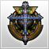

# Rare Skills List

*This page documents the rare skills (Level 151 and above) available in DarkEden.*

## Slayers

### Blader

| Icon | Level | Skill | Description |
|------|-------|-------|-------------|
|  | 161 | Blade Storm | 1 target attack skill. |
|  | 171 | Blaze Walk 2 | Area effect attacking skill to close enemies by jumping toward them. |
|  | 171 | Gladiator | Buff to increase the player's and other slayers damage. |
|  | 181 | Dragon Hurricane | Using it summons a powerful tornado that stuns the enemy. |
|  | 201 | Prayer of War | HP+1000 physical damage+30 |
|  | 201 | Magmatic Eruption | Summons a powerful attacking area that deals damage continuously. |
|  | 211 | Enrage Conqueror | Summons a powerful attacking area that deals damage around the player |
|  | 221 | Advent Blade | Buff that makes blader resist to all incoming attacks. |

### Sworder

| Icon | Level | Skill | Description |
|------|-------|-------|-------------|
|  | 161 | Heavenly Spark | Powerful wide lightning attack. |
|  | 171 | Crushing Storm | Summons a huge lightning in a wide area that increases damage. |
|  | 181 | Lar Stroke | Quick attack 1 target skill. |
|  | 201 | Prayer of Guard | Physical damage+30, magical defense +50. |
|  | 201 | Lightning Shock | Summons a powerful lightning area that deals damage continuously. |
|  | 211 | Attract Circle | Area effect attacking skill to close enemies by jumping toward them. |
|  | 221 | Chain Lightning Sword | Summons a wide lightning area attacking skill. |

### Gunner

| Icon | Level | Skill | Description |
|------|-------|-------|-------------|
|  | 161 | XRL | An upgrade of Plasma Rockets. |
|  | 171 | Satellite Bomb 2 | Powerful laser attack through the upgraded EVE Satellite. Can blind the enemy's screen. |
|  | 181 | Gae Bulga | Fast continuous shooting speed upgraded version of Trident. |
|  | 201 | Prayer of Combat | Critical Hit+50, Tohit+50. |
|  | 201 | Halcyon MK-1 | Armored vehicle made by EVE scientists to counter the flock. |
|  | 211 | Pulse Magnetic Field | Summons a magnetic bomb to disturb the enemy's view, reduces the incoming physical damage. |
|  | 221 | Napalm Bullet | A second powerful skill for the Halcyon MK-1 |

### Healer

| Icon | Level | Skill | Description |
|------|-------|-------|-------------|
|  | 161 | Genesis | Powerful light of judgment used in the war of Gods before. |
|  | 171 | Glory Ground | A Land of glory that heals slayers and causes damage to enemies clearing all enemy's ground skills. |
|  | 171 | Passing Heal 2 | Upgraded version of Passing Heal. |
|  | 171 | Great Heal 2 | Upgraded version of Great Heal. |
|  | 181 | Spector Inverse | Upgraded version of Illusion Inverse using six clones to attack the enemy. |
|  | 201 | Prayer of Saint | Magic defense+30, Magic damage+30. |
|  | 201 | Via Crucis | Summons a huge cross rising from the ground to all enemies around. |
|  | 211 | Depend Soul | Party buff to give the resurrection ability to party members, reduces incoming damage for a short time. |
|  | 221 | Divine Traces | Buff that projects a powerful healing granted from God to the healer. |

### Enchanter

| Icon | Level | Skill | Description |
|------|-------|-------|-------------|
|  | 161 | Thorns | Buff that gives physical damage to enemies around. |
|  | 171 | Intimate Grail 2 | Upgraded version of Intimate Grail |
|  | 171 | Holy Armor 2 | Upgraded version of Holy Armor. |
|  | 171 | Striking 2 | Upgraded version of Striking. |
|  | 171 | Bless 2 | Upgraded version of Bless. |
|  | 181 | Vicious Guidance | A powerful skill that forces the enemy's soul to exit his body. |
|  | 201 | Prayer of Punisher | Magic damage+30, Physical defense+30. |
|  | 201 | Solar Flare | A powerful divine light that deals huge damage to the enemy. |
|  | 211 | Temenos | A powerful circle that stops the enemy's movements. |
|  | 221 | Contradicto | A powerful debuff skill that makes all enemy's buffs disappear. |

### Common (Slayers)

| Icon | Level | Skill | Description |
|------|-------|-------|-------------|
|  | 201 | The Roar of Awaken Warrior | Increases all stats and resistances for a short time. |
|  | 221 | Slayer Mastery | Increases slayers damage by 15%. |

## Vampires

### Melee

| Icon | Level | Skill | Description |
|------|-------|-------|-------------|
|  | 161 | Lethal Claw | A quick attacking target skill, upgraded version of Phantom Buyer Runt. |
|  | 171 | Chain of Demon | Summons darkness forces of evil spirits blocking the enemy's movements and skill casting. |
|  | 181 | Bat Breaker | Powerful wins of evil alter ego mounted on the dash to deal multiple attacks to enemies. |
|  | 201 | Grim Extinction | Physical damage+30, tohit+100. |
|  | 201 | Chaos Splitter | A fast attacking target skill that makes area damage to enemy. |
|  | 211 | Ignis Infernum | Summons an evil area causing continuous damage and increasing physical damage. |
|  | 221 | Wild Wolf Strike | Powerful wolves are summoned to attack the enemy and push him back. |

### Mage

| Icon | Level | Skill | Description |
|------|-------|-------|-------------|
|  | 161 | Bloody Wings | The blood curse can summon demon wings made to revive the dying vampires. |
|  | 161 | Venom Circle | Very strong poison spreading a large area of venom attack. |
|  | 171 | Bloody Skull | Summons evil bloody vampires from the sky dealing damage to the enemy. |
|  | 181 | Shady Douple | A powerful ghost penetrating the enemy and causing him magical damage. |
|  | 201 | Grim Reaper | Magical damage+30, magical defense+30. |
|  | 201 | Deadly Ground | Summons a huge bloody gore surrounding enemies. |
|  | 211 | Demonic Resurrectio | Restores the HP of your allies and heal their silver. |
|  | 221 | Deadly Storm | Creates a deadly toxic area. |

### Common (Vampires)

| Icon | Level | Skill | Description |
|------|-------|-------|-------------|
|  | 171 | Rage of Blood | Restores one's HP for a certain period of time. |
|  | 201 | True Color of Vamp Load | Increases all stats and resistances for a short time. |
|  | 211 | Wolf Road | A buff that improves the main character's stats for a certain time. |
|  | 221 | Vampire Mastery | Increases vampires damage by 15%. |

## Ousters

### Combat

| Icon | Level | Skill | Description |
|------|-------|-------|-------------|
|  | 161 | Brionac | An upgraded version of Destruction Spear that throws a formless spear to the enemy, can deal critical damage. |
|  | 171 | Allyster Wind | A buff made by the power of the wind to increase offensive capabilities. |
|  | 171 | Breath of Dryad | A breath of life in forest that increases the caster's HP. |
|  | 181 | Chakram Hail | Huge falling shards that bring pain to a large number of enemies. |
|  | 201 | Song of Celerity | Physical damage+30, defense+200 |
|  | 201 | Sudden Blast | Can push the enemy with the power of wind causing powerful damage. |
|  | 211 | Evgeneia Bellum | A protective layer buff that reduces incoming damage. |
|  | 221 | Shining Chakram Spin | Summons a giant Chakram with the power of light causing harm to enemies in area. |

### Fire

| Icon | Level | Skill | Description |
|------|-------|-------|-------------|
|  | 161 | Incinerate | A fireball thrown to attack a wide range of areas surrounding the enemy. |
|  | 171 | Flame Sight | Summon a powerful magical flame to see through the darkness with all party members. |
|  | 181 | Flame Spike | Creating a firestorm that attacks the enemy's front. |
|  | 201 | Song of Vigor | Magical damage+30, physical defense+30 |
|  | 201 | Meteor Blaze | Summons a wide area of falling giant fireballs to burn the enemy. |
|  | 211 | Outrage Booster | A debuff skill that reduces the amount of the enemy's all abilities. |
|  | 221 | Infinity Blaze | Summons powerful flame spheres to burn the target and inflict powerful damage. |

### Water

| Icon | Level | Skill | Description |
|------|-------|-------|-------------|
|  | 161 | Frozen Glacier | Fast attack area skill to destroy the enemies and slow them. |
|  | 171 | Life Aqua of Radchia | Summon the Tree of Radchia to treat fatal conditions of your allies and increase their magical damage. |
|  | 181 | Blizzard | Dropping powerful wide ice on the enemy causing them pain. |
|  | 201 | Song of Renewal | Magical damage+30, physical defense+30 |
|  | 201 | Torrential Life | You can fully revive your allies using magical power of water spirits. |
|  | 211 | Ice Pressure | Summons a huge block of ice to damage the enemies and reduce their movement speed by half. |
|  | 221 | Grace of Elquines | Good powerful water buff to raise the main stats of your allies and yours. |

### Earth

| Icon | Level | Skill | Description |
|------|-------|-------|-------------|
|  | 161 | Asteroid Bomber | Summons powerful earth asteroids in the desired area. |
|  | 171 | Spiral Megalith | Summons a giant rock infused with earth element to crush the enemy. |
|  | 181 | Demolisher | The explosion of purple quartz rising from the ground to attack the enemies around. |
|  | 201 | Song of endurance | Magical damage+30, physical defense+30 |
|  | 201 | Cycling WarRock | A buff with the power of the earth spirits to summon huge rocks hover around the caster and deal damage to nearby enemies. |
|  | 211 | Crystal Thorn | Summons sharp crystals in the specified area to deal big damage to enemies. |
|  | 211 | Favor of Luna | Gives a buff to allies and debuff the enemies. |
| *No icon available* | 221 | Summon Defensive Spinel | Summons a mysterious power to protect you from all incoming damage. |

### Common (Ousters)

| Icon | Level | Skill | Description |
|------|-------|-------|-------------|
| *No icon available* | 201 | Holy Rage of Guardian Spirit | Increases all stats and resistances for a short time. |
| *No icon available* | 221 | Ouster Mastery | Increases ousters damage by 15%. |

## Universal Common Skills

| Icon | Level | Skill | Description |
|------|-------|-------|-------------|
|  | 191 | Blast of Assault | Physical damage+40 |
|  | 191 | Blast of Mana | Magical damage+40 |
|  | 191 | Blast of Evasion | Defense+100 |
|  | 191 | Blast of Falcon | Tohit+100 |
|  | 191 | Blast of Vitality | HP+800 |
|  | 211 | Bind of Blood | HP+1500 |
|  | 211 | Bind of Patience | Reduces incoming physical damage by 10% |
|  | 211 | Bind of Spirit | Reduces incoming magical.damage by 10% |
|  | 151 | Increase of Health 1 | HP+100 |
|  | 161 | Increase of Health 2 | HP+150 |
|  | 171 | Increase of Health 3 | HP+200 |
|  | 181 | Increase of Health 4 | HP+250 |
|  | 191 | Increase of Health 5 | HP+300 |
|  | 201 | Increase of Health 6 | HP+350 |
|  | 211 | Increase of Health 7 | HP+400 |
|  | 221 | Increase of Health 8 | HP+450 |
|  | 231 | Increase of Health 9 | HP+500 |
|  | 241 | Increase of Health 10 | HP+550 |
|  | 251 | Increase of Health 11 | HP+600 |
|  | 261 | Increase of Health 12 | HP+650 |
|  | 271 | Increase of Health 13 | HP+700 |
|  | 281 | Increase of Health 14 | HP+750 |
|  | 291 | Increase of Health 15 | HP+800 |

## External Links

* [Slayers skills on DKLegend](http://www.dklegend.com/market/listdetail/groupid/270)
* [Vampires skills on DKLegend](http://www.dklegend.com/market/listdetail/groupid/271)
* [Ousters skills on DKLegend](http://www.dklegend.com/market/listdetail/groupid/272)
* [Common skills on DKLegend](http://www.dklegend.com/market/listdetail/groupid/247)
